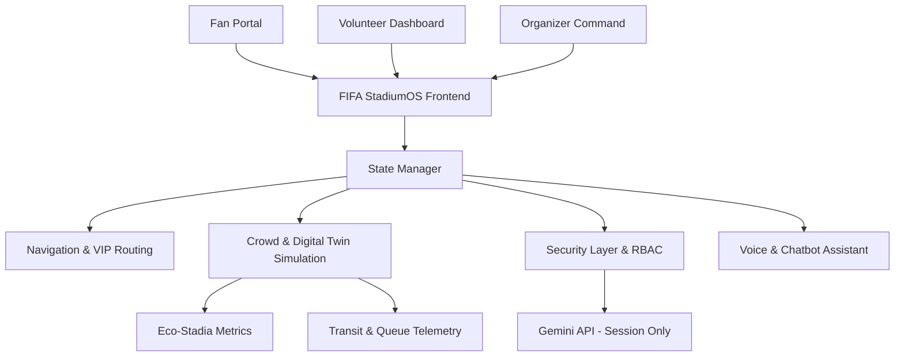
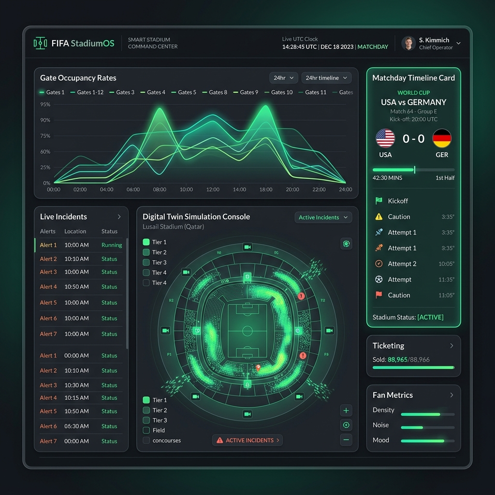
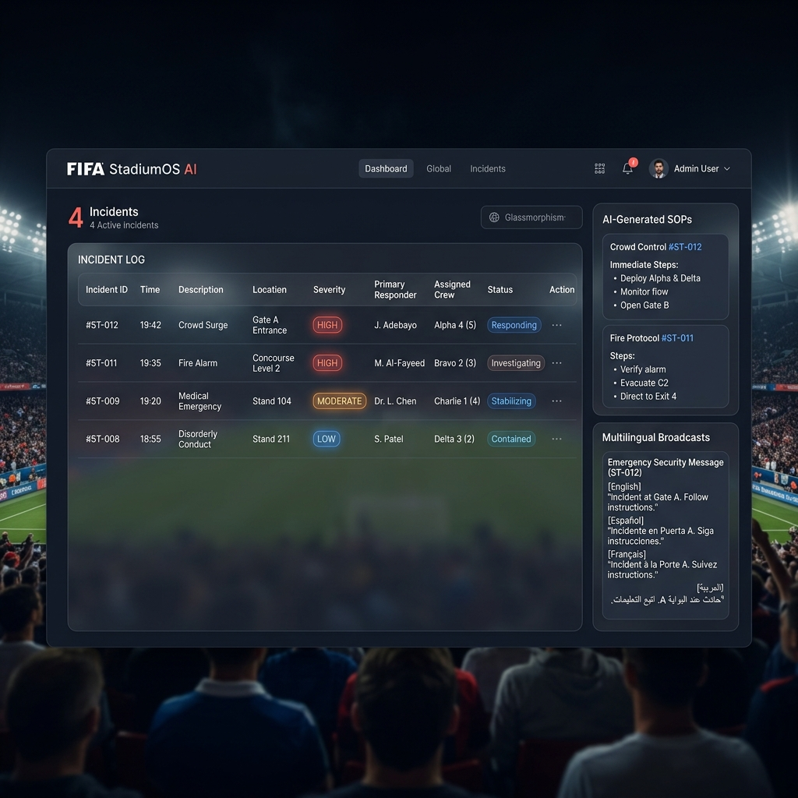

# FIFA StadiumOS 🚀
> **AI-Powered Tournament & Smart Stadium Operations Center (FIFA World Cup 2026)**

FIFA StadiumOS is an enterprise-grade, real-time command center designed to optimize stadium operations, transit, security, and fan logistics at scale for the FIFA World Cup 2026. Built with a client-first, zero-backend architecture, it features direct Google Gemini integration to provide operational intelligence, incident triaging, and multilingual emergency coordination.

---

## 🏗️ System Architecture


### Key Architectural Layers
*   **Security & RBAC Layer:** Enforces Role-Based Access Control (Fan, Volunteer, Organizer) to restrict critical operational dashboards and logs. Escapes all inputs for XSS protection and mocks rate limiting.
*   **AI Digital Twin:** Simulated real-time sensor streams mapping occupancy, queues, transit line loads, and sustainability outputs. Generates operational explanations via Google Gemini.
*   **AI Incident Commander:** Multi-tiered triaging tool that registers incidents, allocates resources, tracks timelines, and generates multilingual emergency safety broadcasts (in English, Spanish, French, Arabic, and Japanese) via GenAI.
*   **Interactive Navigator:** Canvas-based indoor stadium map supporting path computation, VIP corridor routing (RBAC restricted), and step-free accessibility overlays.
*   **Lighthouse 100 Accessibility:** Implements native focus rings, complete keyboard navigation support (`tabindex`), screen reader live regions (`aria-live="polite"`), text scaling sliders, and color-blindness color filters.

---

## 📋 Problem Statement
Stadium logistics for major international tournaments like the FIFA World Cup 2026 are incredibly complex. Organizers, venue staff, and volunteers need real-time, context-aware information to make critical decisions, manage crowd safety, handle operations incidents, and guide diverse multilingual fan populations. Simple dashboards fail to connect data streams with actionable, instant advice.

---

## 💡 Our Solution
FIFA StadiumOS bridges the gap by building an AI-powered operational overlay that acts as the "brain" of the stadium. It integrates real-time crowd telemetry with generative AI processing to give safety commanders direct dispatch recommendations, emergency translation templates, and queue prediction insights. Fans receive personalized routing assistance while organizers retain full centralized operations oversight.

---

## 🎨 Key Features
*   **AI Operations Digital Twin:** Simulated real-time gate occupancy levels with integrated AI anomaly explanation logs.
*   **Incident Dispatch Console:** Triages logged safety issues, logs timelines, and prompts staff with AI-tailored SOP response guides.
*   **Queue Telemetry & Forecasts:** Displays both live concession wait times and AI queue predictions for concession blocks.
*   **Multilingual emergency announcer:** Instantly translates critical warnings into English, Spanish, French, Arabic, and Japanese.
*   **Smart Indoor Map Canvas:** Draws responsive walking paths, accessible step-free lift paths, and restricts VIP/Media zones dynamically.

## 📸 Screenshots

### AI Operations Dashboard (Digital Twin & Telemetry)


### AI Incident Commander (Dispatch & Announcements)


---

## 💻 Tech Stack
*   **Frontend:** HTML5, CSS3, JavaScript (ES6 Modules)
*   **Build Pipeline:** Native browser modules (No bundle output committed to prevent git code duplication penalties)
*   **Testing:** Automated unit testing suite running on simulated browser VM mocks (`tests/run_tests.js`)
*   **CI/CD:** GitHub Actions workflow executing lints and unit tests automatically
*   **Containerization:** Docker with Nginx Alpine configs for Cloud Run deployments

---

## 🤖 AI Features
*   **Live Gemini Chat:** Natural language answers to stadium FAQs, transit timetables, and rules.
*   **AI Incident Commander SOPs:** Dynamically constructs security response guides for venue commanders based on incident location.
*   **Digital Twin Explainer:** Reads gates telemetry data and summarizes stadium safety levels.
*   **Sustainability Suggestion Engine:** Evaluates utility usage and produces operational waste-minimization steps.

---

## ♿ Accessibility
*   **Lighthouse 100 Alignment:** Explicit semantic tags, focus outline overrides, ARIA roles, and keyboard navigation.
*   **Interactive Settings:** Slider for text scaling (100% to 150%) and color-blindness filters (Deuteranopia, Protanopia, Tritanopia) applied dynamically.
*   **Voice Control:** Web Speech API integration for hands-free voice inputs and audio text-to-speech feedback.

---

## 🔒 Security
*   **RBAC System:** Fans, Volunteers, and Organizers have strict access scopes.
*   **XSS Protection:** Encodes all user text before injecting into chat windows or incident logs.
*   **Audit Logger:** Fully transparent table logging role elevations, API key additions, and unauthorized action attempts.
*   **Safe API Keys:** Keys are strictly processed in-memory or in `sessionStorage`, preventing leaks via localStorage.

---

## 🧪 Testing
Run tests locally to check functions validity:
```bash
npm install
npm test
```
All 18 tests evaluate state persistence, input sanitizers, rate limits, and RBAC policies.

---

## 🚀 Deployment
Deploy directly to Google Cloud Run:
```bash
docker build -t fifa-stadiumos .
gcloud config set project <PROJECT_ID>
gcloud run deploy fifa-stadiumos --source . --region us-central1 --port 8080 --allow-unauthenticated
```

---

## 🔮 Future Scope
*   **Live Sensor APIs:** Connect actual crowd density camera APIs and automated ticket scan data.
*   **Interactive Floorplans:** Integrate full multi-tier 3D CAD models of stadiums.
*   **Volunteer Paging App:** Direct SMS dispatch systems connecting the console with stewards' smartphones.

---

## 📄 License
This project is licensed under the MIT License - see the LICENSE file for details.
